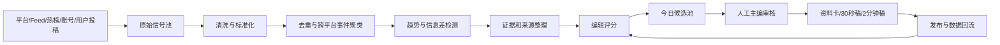

# AI 编辑部系统 PRD V1.2

> 文档状态：已补充 MediaCrawler 采集增强与平台账号风险控制 / 可执行基线  
> 编写日期：2026-08-04  
> 适用阶段：MVP → V1  
> 核心目标：从多平台公开信息中发现候选事件，判断哪些内容对账号的播放、互动和涨粉最有价值，并生成可核验、可编辑、可发布的短视频资料包。

---

## 1. 项目概述

### 1.1 产品名称

暂定：**AI 编辑部 / EventDesk AI**

### 1.2 产品定位

本系统不是传统新闻聚合器，也不是自动化营销号生成器，而是一套面向短视频创作者的 **事件发现、资料整理、流量判断与内容生产辅助系统**。

系统每天从国内外多个平台采集公开信号，将零散帖子、视频、评论、媒体报道和官方回应聚合为“事件”，再依据账号价值进行筛选，最终输出：

- 今日值得讲的 TOP 事件；
- 事件事实链与来源；
- 国内外信息差；
- 用户情绪、画面价值与传播潜力；
- 30 秒快讲稿、2—3 分钟完整稿；
- 待核实项、风险提示和素材清单；
- 发布后数据复盘与评分模型修正。

### 1.3 核心产品承诺

> 用户每天能够在一个账号里，用较短时间看到几件“值得知道、值得讨论、值得转发”的事情，并且第一次看就能理解前因后果。

“值得讲”首先是对账号增长有价值，包括播放、完播、点赞、评论、转发和关注；可信度不是唯一排序条件，但属于必须守住的底线。

---

## 2. 背景与问题

### 2.1 当前痛点

1. **算法信息茧房**：创作者只能看到平台推给自己的内容，大量潜在事件不可见。
2. **消息来源分散**：事件可能最早出现在普通用户视频、地方媒体、海外社区、评论区或综艺片段中。
3. **关键词依赖**：传统爬虫只有知道关键词后才能搜索，无法有效发现“尚不知道该搜什么”的事件。
4. **重复信息过载**：同一事件被几十个账号反复搬运，人工很难还原源头和新增信息。
5. **选题靠感觉**：缺乏可复盘的“值得讲”判断体系，难以形成团队能力。
6. **事实与流量冲突**：纯新闻号表达严肃、传播弱；纯营销号速度快，但容易失真和透支信任。
7. **内容无法沉淀**：每天从零开始找热点，选题、稿件、数据表现和判断经验没有进入知识库。

### 2.2 产品机会

通过“多源发现 + 事件聚合 + 编辑判断 + 人工审核”，在严肃媒体与营销号之间形成差异化：

- 比普通用户看得更广；
- 比营销号讲得更完整；
- 比传统新闻更口语、更有情绪和画面；
- 不追求绝对首发，但争取成为用户第一次看懂该事件的内容。

---

## 3. 产品目标与非目标

### 3.1 MVP 目标

在两周左右完成一条可验证闭环：

```text
多平台采集公开信号
→ 标准化与去重
→ 聚合为候选事件
→ AI 进行流量价值判断
→ 人工选择 TOP 事件
→ 输出事件资料卡与口播稿
```

MVP 重点验证：

1. 系统能否发现人工日常刷不到的候选事件；
2. 聚类后是否显著降低重复信息；
3. TOP 事件是否比随机刷视频更“值得讲”；
4. AI 资料卡能否减少人工查资料与写稿时间；
5. 每条内容是否保留可追溯来源和不确定性标记。

### 3.2 V1 目标

- 支持可插拔的平台连接器；
- 支持事件生命周期和增量更新；
- 支持多个内容栏目采用不同评分标准；
- 支持本地模型、OpenAI 兼容接口和不同云模型动态切换；
- 支持发布后数据回流，持续校准选题判断；
- 形成每日可执行的“编辑部晨会/晚报”工作台。

### 3.3 非目标

MVP/V1 暂不包含：

- 自动发布到抖音、微博等平台；
- 无人工确认的自动新闻播报；
- 大规模下载和永久保存所有原始视频；
- 绕过平台验证码、风控、付费墙或权限控制；
- 对个人进行隐私画像或敏感属性推断；
- 以“AI 判断”替代法律、监管或专业机构结论。

---

## 4. 目标用户与使用场景

### 4.1 核心用户

- 1—5 人的短视频内容团队；
- 信息差、热点总结、社会事件、娱乐综艺、国际奇闻类账号；
- 需要提高选题效率的个人创作者；
- 后续可扩展至品牌内容团队、MCN 和媒体编辑部。

### 4.2 典型场景

#### 场景 A：每日信息差合集

每天晚上选出 4—6 个用户大概率没有刷到、但有传播价值的事件，用口语化方式串联成一条视频。

#### 场景 B：单一事件快讲

食品安全、台风灾情、监管调查等事件，在尚无最终结论时，讲清“目前确认了什么、还缺什么”。

#### 场景 C：人物与成长深挖

数学家获奖、运动员突破、导演或演员回归等，从成长经历、行业环境和大众情绪角度讲 2—3 分钟。

#### 场景 D：娱乐综艺与网络片段

把综艺高光、影视片段、明星互动和网络梗整理清楚，解释为什么突然引发讨论，而不是只搬运片段。

#### 场景 E：传闻与辟谣

对演唱会、合作、品牌事件等传闻，区分已确认、媒体引用、单一截图和纯猜测，输出低风险内容角度。

---

## 5. 内容栏目设计

同一账号可以存在多个固定栏目，但用户需要形成稳定预期。

| 栏目 | 典型时长 | 主要价值 | 证据要求 | 评分重点 |
|---|---:|---|---|---|
| 今日信息差 | 2—4 分钟 | 新奇、谈资、轻情绪 | 中等 | 新奇度、画面感、国内缺口 |
| 事件快讲 | 30—90 秒 | 快速看懂当前进展 | 较高 | 时效、公共相关度、信息增量 |
| 深挖还原 | 2—5 分钟 | 背景、人物、时间线 | 高 | 故事性、长期价值、资料完整度 |
| 真假拆解 | 1—3 分钟 | 识别传闻、建立信任 | 很高 | 来源质量、证据冲突、表达风险 |
| 娱乐综艺 | 30—120 秒 | 情绪、共鸣、梗 | 中等 | 讨论度、粉丝情绪、可视素材 |
| 食品与消费安全 | 1—4 分钟 | 公共利益、避坑 | 很高 | 监管进展、证据链、普通人影响 |
| 国际社会奇闻 | 30—120 秒 | 信息差、猎奇、文化解释 | 中等 | 海外热度、国内缺口、文化转译 |

---

## 6. “值得讲”判断模型

### 6.1 基本原则

“值得讲”不是“最重要的新闻”，也不是“最可信的消息”，而是：

> 在不突破事实与合规底线的前提下，最可能为账号带来播放、互动和新增关注，并让用户看完有所得的内容。

### 6.2 流量价值评分（0—100）

| 维度 | 权重 | 判断问题 |
|---|---:|---|
| 情绪张力 | 20 | 是否能引发惊讶、愤怒、好笑、共鸣、怀旧或感动？ |
| 信息差 | 15 | 目标用户是否大概率尚未看到？国内是否尚未大面积传播？ |
| 画面与素材 | 15 | 是否有现场视频、截图、人物、反差或具体动作？ |
| 普通人相关度 | 15 | 用户能否代入生活、消费、工作、家庭或社交？ |
| 讨论与评论空间 | 15 | 是否天然存在立场、选择、争议或提问？ |
| 新奇与反转 | 10 | 是否违背直觉、出现意外进展或“前后不一样”？ |
| 延展性 | 10 | 能否关联人物、历史、行业、科普或后续进展？ |

### 6.3 风险评分（独立于流量分）

风险不与流量简单相减，而是作为发布门槛和表达策略。

| 等级 | 状态 | 处理方式 |
|---|---|---|
| R0 | 多方权威确认 | 可直接讲，仍保留来源 |
| R1 | 权威媒体报道 / 官方正在调查 | 可讲“已介入、尚无最终结论” |
| R2 | 单一可信来源或完整原视频 | 可进入观察池，谨慎表述 |
| R3 | 只有截图、口述或搬运视频 | 不下结论，可做“传闻为何传播” |
| R4 | 明显伪造、侵权或高法律风险 | 不做 |

### 6.4 最终排序

```text
最终优先级 = 流量价值 × 栏目匹配度 × 时效系数 - 风险处罚 - 素材缺失处罚
```

权重必须可配置，不同栏目使用不同模板。例如食品安全栏目提高“证据完整度”，国际奇闻栏目提高“信息差”和“画面感”。

---

## 7. 端到端工作流



### 7.1 发现层

同时支持两种发现方式：

- **无关键词发现**：读取热榜、最新流、Rising、热门板块、RSS、新发布账号内容；
- **有关键词补全**：事件出现后，自动生成关键词，在国内外平台补齐资料和评论。

### 7.2 事件层

系统的核心单位是“事件”，而不是“帖子”。同一事件可包含：

- 最早信号；
- 不同平台的搬运、评论和媒体报道；
- 官方/企业回应；
- 新增进展；
- 视频、截图和文字素材；
- 已确认事实与待核实项。

### 7.3 编辑层

每日分三次运行：

- 上午：生成早期线索池；
- 下午：补齐国内讨论和事实来源；
- 傍晚：收口、评分、人工选择并生成稿件。

事件可以跨天存在，系统不以“发生日期”判断是否过期，而以“今天是否出现新增讨论或信息增量”判断是否值得讲。

---

## 8. 平台接入规划

### 8.1 接入原则

1. 平台不是写死在代码中的枚举，而是可注册、可禁用、可配置的连接器；
2. 优先官方 API、RSS、公开 Feed 和授权数据；
3. 浏览器自动化只作为补充，并控制频率；
4. 每个平台单独维护权限、配额、登录态和数据保留规则；
5. 接口变化时不影响事件聚合和编辑模块；
6. 所有浏览器自动化连接器必须经过账号风险保护层，明确区分可重试错误与不可重试的风控信号；
7. 对明确的权限拒绝、验证码、账号异常和平台限制，不自动反复登录或继续请求；
8. 不以验证码破解、指纹伪造、封禁后自动换号或代理轮换绕过限制作为产品能力。

### 8.2 平台优先级

#### P0：MVP 必接

| 平台/来源 | 用途 | 建议方式 |
|---|---|---|
| RSS / Atom / 新闻最新页 | 公开新闻、地方媒体、科技博客 | 官方 Feed 优先 |
| Reddit | 海外奇闻、科技、影视、社会苗头 | 官方接口 / 合规访问 |
| 微博 | 国内热议、明星、媒体与官方回应 | MediaCrawler 原型或授权方案 |
| B站 | 视频素材、长视频标题、评论观点 | MediaCrawler 原型 / 官方开放能力 |
| 知乎 | 背景解释、争议问题、用户观点 | MediaCrawler 原型 |
| 国内热榜聚合 | 无关键词发现 | 自建轻量榜单连接器 |
| 手工 URL / 文件导入 | 用户发现线索后的快速入库 | 必须支持 |

#### P1：V1 扩展

| 平台 | 核心价值 | 接入说明 |
|---|---|---|
| 抖音 | 国内短视频热点与评论情绪 | 原型可使用 MediaCrawler；生产需重新评估授权、风控和许可 |
| 小红书 | 消费、生活方式、普通用户体验 | 同上；控制采集规模 |
| 快手 | 下沉市场、地方生活和真实现场 | 同上 |
| YouTube | 海外长视频、Shorts、频道追踪 | 优先 YouTube Data API；注意配额 |
| X / Twitter | 海外记者、媒体、科技和娱乐苗头 | 官方 API；按访问套餐和查询配额配置 |
| Instagram / IG | 海外娱乐、明星、Reels、视觉文化 | 官方 API 主要面向授权的专业账号；公共发现能力有限，应支持“监控账号列表 + 合规第三方数据源”两种模式 |
| TikTok | 海外短视频趋势 | Display API 适合授权创作者；Research API 受资格和非商业研究限制；商业发现需另行评估合规来源 |
| 豆瓣 | 影视、书影音口碑 | 独立连接器，低频、合规采集 |

#### P2：后续观察

- Threads；
- Facebook 公开页面；
- Telegram 公开频道；
- Discord 公开社区；
- 海外地方新闻站；
- 影视节目播出平台与官方账号；
- 用户投稿、邮件、Webhook、浏览器收藏插件；
- 第三方合法数据服务。

### 8.3 动态平台注册

平台连接器的日常配置必须通过可视化后台完成，不要求运营人员直接修改 YAML、JSON、`.env` 或代码。后台需支持：

- 新建、复制、归档和删除连接器实例；
- 启用/禁用和批量启停；
- 设定采集频率、时间窗口、单次最大数量和重试策略；
- 设置关键词、账号、板块、Feed、地区和语言；
- 设置评论抽样数、媒体处理级别和存储策略；
- 单独配置代理、Cookie、API Key、OAuth 和扫码登录状态；
- 测试连接、立即运行、查看最近运行结果；
- 查看健康状态、配额、最近失败原因和登录过期提醒；
- 导入、导出和回滚连接器配置。

YAML 仅作为系统初始化、批量导入导出、环境迁移和灾难恢复格式，不作为日常操作入口。

### 8.4 Schema 驱动的动态表单

每个连接器必须提供能力声明和配置 Schema。前端根据 Schema 自动生成表单，并只展示该平台实际支持的字段。例如：

- 微博：关键词、账号、搜索/详情/评论模式、登录态和抽样数量；
- Reddit：Subreddit、`new/rising/hot`、时间窗口和最低互动阈值；
- RSS：Feed 地址、抓取频率、语言、国家和可信等级；
- Instagram：OAuth 授权账号、监控账号列表和授权范围；
- MediaCrawler 平台：平台代码、扫码登录、Cookie、关键词、账号和评论策略。

新增平台时，基础表单应通过 Schema 自动生成；只有特殊授权流程、扫码登录和复杂账号管理才需要编写平台专属界面。

### 8.5 MediaCrawler 采集增强范围

本项目不复刻 MediaCrawler Pro，也不把全部 Pro 功能纳入开发范围。仅吸收与“事件发现、稳定采集和账号保护”直接相关的五项设计思想：

1. **断点续采**：任务中断后从已保存的游标、页码、最后内容 ID 或时间水位继续；
2. **增量采集**：下一轮只获取新内容或有新增互动、评论、回应的内容；
3. **账号与代理抽象**：统一账号、登录态、浏览器 Profile 和可选代理的配置模型，但 MVP 不实现封禁后自动换号或大规模代理池轮换；
4. **签名逻辑解耦**：将平台签名能力封装为可替换接口，首期仍复用开源版现有实现；
5. **首页流与热榜补充发现**：热榜作为独立连接器优先建设；HomeFeed 只在 V1 对少数平台低频灰度启用，不作为唯一未知事件发现来源。

明确不纳入首期的内容：全面去除 Playwright、重写全部平台签名、通用桌面视频下载器、在采集器内部重复建设 AI Agent、全平台 HomeFeed 一次性接入。

---

## 9. 核心功能需求

### FR-01 信号源管理

- 管理平台、账号、RSS、板块、关键词和热榜入口；
- 给来源标记国家、语言、领域和可信级别；
- 记录“最终被采用的事件最早来自哪个来源”；
- 统计各来源的命中率和转化率。

### FR-02 多平台采集

- 定时采集最新内容；
- 支持按账号、板块、Feed、热榜、关键词、指定 URL 获取；
- 支持增量游标和断点续采；
- 支持评论抽样，而非默认抓取全部评论；
- 保存原始链接、发布时间和原始文本。

### FR-03 内容解析

- 读取标题、正文、作者、互动量和媒体信息；
- 优先使用已有字幕；
- 候选内容再进行语音转写；
- 只有高优先级内容才抽取视频关键帧或图片文字。

### FR-04 去重与事件聚类

- URL 去重、文本相似去重、跨语言语义聚类；
- 将同一事件的不同平台信号合并；
- 支持人工拆分或合并错误事件；
- 保存事件版本和增量变化。

### FR-05 趋势和信息差检测

- 互动增长异常；
- 同一事件跨平台出现；
- 多个不相关来源同步出现；
- 海外讨论较高但国内讨论较少；
- 评论出现集中情绪或“第一次知道”等信号。

### FR-06 证据与事实管理

- 每条事实绑定来源；
- 区分原始视频、媒体报道、官方回应、企业声明、网友评论；
- 标注“已证实 / 调查中 / 单一来源 / 传闻”；
- 对互相冲突的来源并列展示，不强制自动下结论。

### FR-07 编辑评分

- 支持多栏目评分模板；
- 输出每个维度的分数和一句理由；
- 输出推荐形式：合集、30 秒、90 秒、2—3 分钟、暂不做；
- 支持人工修改分数和添加主编意见。

### FR-08 每日候选池

- 展示 TOP 20 / TOP 10 / TOP 5；
- 按流量潜力、领域、风险和信息差筛选；
- 显示事件来源数、增长速度和最新更新时间；
- 支持“采用、观察、放弃、归档”。

### FR-09 内容资料包

每个入选事件输出：

- 一句话概述；
- 完整时间线；
- 已确认事实；
- 待核实内容；
- 不同观点；
- 推荐切入角度；
- 不建议使用的标题或表达；
- 评论区问题；
- 素材清单；
- 30 秒稿、2—3 分钟稿；
- 来源清单。

### FR-10 知识库与复盘

- 保存事件、稿件、发布时间、播放和互动数据；
- 记录“推荐但未采用”“放弃后爆发”的错题；
- 统计栏目、来源、情绪和标题模板表现；
- 逐步调整评分权重，而不是依靠一次性的主观设定。

### FR-11 AI 模型管理

- 兼容 OpenAI 风格接口；
- 支持本地 Ollama / llama.cpp 与云模型；
- 通过可视化页面新增、编辑、启用和停用 Provider；
- 支持测试 Base URL、API Key、模型可用性和结构化输出能力；
- 按任务选择模型：Embedding、抽取、聚类、评分、证据、写稿、复核、视觉和 ASR；
- 通过下拉框配置主模型、备用模型、超时、重试和预算超限降级策略；
- 记录每次调用的 Token、费用、耗时和结果；
- 允许模型降级和失败重试。

### FR-12 可视化配置中心

配置中心至少包含：

1. **连接器中心**：连接器实例列表、启停、编辑、立即运行、健康检查、日志和登录状态；
2. **AI Provider 中心**：供应商、Base URL、凭据、模型、预算、并发和连接测试；
3. **AI 任务路由**：为每类任务设置主模型、备用模型和失败策略；
4. **调度中心**：采集频率、每日收口时间、任务开关和下一次运行时间；
5. **评分模板中心**：栏目权重、证据门槛、风险门槛和版本；
6. **配置导入导出**：支持 YAML/JSON 备份、批量导入、差异预览和回滚；
7. **审计记录**：记录谁在何时修改了什么配置以及修改前后的版本。

### FR-13 凭据与敏感配置管理

- API Key、Cookie、OAuth Token 和代理密码不得明文返回前端；
- 页面只显示掩码，例如 `sk-****8df2`；
- 修改凭据采用“替换”而不是“读取原值”；
- 数据库存储加密值或 Secret 引用；
- 系统加密主密钥保留在部署环境，不保存在业务数据库；
- 凭据过期、OAuth 失效和扫码登录失效需要产生提醒；
- 所有敏感配置操作写入审计日志。

### FR-14 MediaCrawler 采集增强

- 每个 MediaCrawler 连接器支持断点、时间水位和最后内容 ID；
- 任务中断后可继续，而不是默认从第一页重新开始；
- 相同内容、相同详情和相同评论页避免重复请求；
- 账号、浏览器 Profile、登录凭据与连接器实例解耦；
- 平台签名能力通过 `SignatureProvider` 接口封装；
- 热榜连接器负责无关键词发现，MediaCrawler 负责候选事件补全；
- HomeFeed 采用白名单平台、低频、少量、可随时停用的灰度策略。

### FR-15 平台账号风险控制

系统必须提供独立的账号与采集风险保护机制：

- 使用独立测试账号，不使用正式运营账号和个人主账号执行自动采集；
- 账号状态至少包含 `healthy / warning / cooldown / review_required / restricted / disabled`；
- 区分网络超时等可重试错误，与验证码、403、406、429、权限拒绝、`account blocked`、检测到自动化等不可自动重试风险；
- 出现不可重试风险时立即停止当前任务、暂停账号或平台队列，并要求人工检查；
- 对平台、账号、连接器实例和单次任务设置请求量、内容量、评论量与运行次数预算；
- 新平台和新账号采用“连通性测试 → 低量试运行 → 受控运行”的分级启用流程；
- 同一内容优先读取数据库缓存，不在短时间内反复访问；
- 高风险平台优先承担候选事件补全，不作为全天候大规模发现入口；
- 后台展示风险事件日志、账号状态、今日预算、暂停原因和人工恢复入口；
- 不实现验证码破解、浏览器指纹伪造、明确受限后的持续重试、封禁后自动换号等绕过机制。

---

## 10. AI 能力规划

### 10.1 MVP 所需 AI 能力

1. 实体与事件要素抽取；
2. 相似内容聚类与跨语言合并；
3. “值得讲”结构化评分；
4. 来源状态和待核实项提取；
5. 资料卡和口播稿生成。

### 10.2 模型策略

- 云端低价 Embedding：MVP 默认用于去重、向量检索和跨语言召回；
- 本地 Embedding：作为离线、隐私或成本优化的可切换备用方案；
- 低价云模型：批量评分和结构化抽取；
- 较强模型：TOP 事件深度分析和最终稿；
- 视觉模型：仅用于候选事件的关键帧、截图和图中文字；
- 人工：最终选题、事实判断和发布确认。

### 10.3 AI 输出要求

- 强制 JSON Schema；
- 不允许没有来源的事实进入“已确认事实”；
- 分开输出“事实、推测、编辑观点”；
- 所有模型结果可人工修改；
- 模型不得自动发布内容。

---

## 11. 事件资料卡示例

```yaml
事件名称: 乐事相关土豆副产物被指流向食用淀粉链条
状态: 调查中
栏目: 食品与消费安全
首次发现: 2026-07-29
最新更新: 2026-08-02

流量价值:
  总分: 91
  情绪张力: 19/20
  信息差: 13/15
  画面素材: 15/15
  普通人相关: 15/15
  讨论空间: 14/15
  新奇反转: 8/10
  延展性: 7/10

风险:
  等级: R1
  说明: 媒体称监管部门已关注并调查，尚无最终书面通报

已确认:
  - 有媒体发布卧底调查内容
  - 媒体引用监管工作人员称正在调查处置

待核实:
  - 涉事批次和具体数量
  - 原料最终流向和责任主体
  - 监管检测结果

推荐角度:
  - 先讲完整流向和调查状态
  - 再解释食品工业副产物合规利用与食用原料红线

不推荐角度:
  - 在最终通报前断言品牌故意售卖有毒食品
```

---

## 12. 产品界面草案

### 12.1 首页

- 今日信号数量；
- 新增事件数量；
- TOP 5；
- 调查中事件；
- 连接器健康状态；
- 今日 API 成本。

### 12.2 事件工作台

- 左侧：候选事件列表；
- 中间：时间线、来源、素材和评论；
- 右侧：评分、风险、栏目、主编意见；
- 底部：30 秒稿、2 分钟稿和修改历史。

### 12.3 来源工作台

- 各来源今日贡献事件数；
- 被采用率；
- 首发命中率；
- 平均提前量；
- 失败率和配额状态。

### 12.4 连接器管理中心

- 连接器卡片或表格列表；
- 已注册、已实现、已启用、已验证四种状态；
- 新建、复制、编辑、批量启停、立即运行；
- Schema 驱动的动态配置表单；
- 登录、扫码、OAuth 和 Cookie 状态；
- 最近运行时间、下次运行时间、采集数量和错误；
- 运行日志、健康检查和配置历史。

### 12.5 AI Provider 与任务路由中心

- Provider 列表、连接状态、已配置模型和今日费用；
- 新增 Provider、替换密钥、测试连接和同步模型列表；
- 为 Embedding、抽取、聚类、评分、证据、写稿和复核配置主/备用模型；
- 设置超时、重试、并发、日预算和月预算；
- 预算或服务异常时的降级链；
- 每个任务的成功率、延迟和费用统计。

### 12.6 配置备份与审计

- YAML/JSON 导入导出；
- 导入前差异预览；
- 配置版本、修改人和修改时间；
- 一键回滚到上一版本；
- 敏感字段在导出时默认脱敏或排除。

### 12.7 账号安全与风险控制中心

- 平台账号列表、账号用途、绑定浏览器 Profile 和当前状态；
- 最近成功时间、最近风险代码、连续失败次数和冷却截止时间；
- 单次、每日请求预算与评论抽样预算；
- “测试连接、低量试跑、暂停、人工恢复、重新登录”操作；
- 风控事件时间线，明确系统采取了停止、熔断或降级动作；
- 高风险平台默认模板，例如并发 1、少量内容、关闭二级评论和禁止自动重新登录；
- 页面明确提示：风险控制只能降低概率，不能保证账号绝对不受限。

---

## 13. MVP 范围

### 13.1 必须完成

- RSS / 新闻 Feed；
- Reddit；
- 微博、B站、知乎中的至少两个平台；
- 手工 URL 导入；
- 统一数据结构；
- 文本去重与事件聚类；
- 流量价值评分与风险分级；
- 每日 TOP 10；
- TOP 3 资料卡；
- 30 秒稿和 2 分钟稿；
- 来源可追溯；
- API 成本日志；
- 人工采用/放弃与备注；
- 基础连接器配置中心：列表、启停、编辑、立即运行和健康状态；
- 基础 AI Provider 配置：新增、测试连接、模型选择和任务路由；
- API Key/Cookie 掩码显示与加密保存；
- 配置导出和修改审计；
- MediaCrawler 断点续采、增量水位和幂等去重基础能力；
- 风控错误分类、不可重试异常、账号状态机和单平台熔断；
- 平台/账号/任务三级采集预算与独立测试账号提示；
- 账号风险日志和人工恢复入口。

### 13.2 MVP 暂缓

- Instagram、TikTok、X 的复杂接入；
- 视频全量下载；
- 自动视觉分析全部内容；
- 自动发布；
- 多租户和复杂权限；
- 完整移动端；
- 全平台 HomeFeed；
- 自动账号轮换和大规模代理池；
- 全面去除 Playwright 或重写全部签名；
- 验证码破解、指纹伪造和其他绕过平台安全措施的功能。

---

## 14. 验收标准

### 14.1 数据与发现

- 每天可稳定采集至少 5 类来源；
- 所有事件保留原始链接和采集时间；
- 系统支持无关键词入口和关键词补全；
- 可人工新增一个平台连接器配置，而不修改核心编辑逻辑。

### 14.2 聚类与判断

- 在人工标注样本中，大部分重复内容可被正确合并；
- 每个评分维度均有可读理由；
- 风险状态与流量价值分开显示；
- 支持人工拆分、合并和改分。

### 14.3 内容输出

- TOP 事件资料卡包含来源、时间线、事实、待核实项和素材；
- 口播稿不把“调查中”写成“已经定案”；
- 生成内容符合栏目时长与口语风格；
- 人工能够在工作台中直接编辑后导出 Markdown。

### 14.4 成本与稳定性

- 每次 AI 调用有 Token、模型和成本记录；
- 单一平台故障不影响其他来源运行；
- 采集失败可重试并有错误日志；
- 登录凭据和 API Key 不写入代码仓库。

### 14.5 配置中心

- 用户无需修改代码或 YAML 即可新增、编辑、启停连接器；
- 用户无需重启主服务即可修改普通采集参数和 AI 路由；
- 不同平台根据能力 Schema 展示不同表单；
- Provider 可执行连接测试并显示明确失败原因；
- API Key、Cookie 和 Token 不可从前端反向读取；
- 配置修改有版本记录，可导出并至少回滚上一版本；
- 错误配置不能覆盖当前有效配置，保存前必须完成 Schema 校验。

### 14.6 采集恢复与账号风险控制

- 任务中断后能够从 checkpoint 或时间水位继续，重复内容不会重复入库；
- 明确的权限拒绝、验证码、账号受限和自动化检测信号不会进入普通重试循环；
- 触发不可重试风险时，任务和账号状态会被自动暂停并产生可读日志；
- 单账号达到日预算后不再创建新的自动任务；
- 新账号可执行连通性测试和低量试运行，不会直接进入常规定时采集；
- 小红书、抖音等高风险平台可切换为“仅候选事件补全”模式；
- 系统不提供验证码破解、自动换号绕过或持续对抗平台限制的能力。

---

## 15. 里程碑

### M0：规则确认（2—3 天）

- 确定栏目；
- 确定评分维度；
- 人工标注 30—50 个历史事件作为基准集。

### M1：采集与数据层（3—5 天）

- RSS、Reddit、手工导入；
- MediaCrawler 现有平台接入；
- 标准化数据与数据库；
- checkpoint、增量水位、请求预算和风险错误分类；
- 账号状态、熔断与人工恢复基础接口。

### M2：事件与 AI 层（4—7 天）

- 去重、向量聚类；
- 事件卡；
- AI 评分、风险状态和资料卡；
- MediaCrawler 七个平台账号抽象和签名接口预留；
- 首批平台低量试运行与风险日志。

### M3：工作台与日报（3—5 天）

- 候选池；
- 人工审核；
- Markdown 导出；
- 成本日志。

### M4：一周实跑

- 每日使用；
- 对比系统推荐与实际发布；
- 修正来源和评分权重；
- 决定是否进入 V1。

---

## 16. 合规、版权与安全

1. MediaCrawler 当前许可证为非商业学习用途，原型阶段可用于研究验证；准备商业化前必须获得书面商业授权，或重新实现独立采集器。
2. 每个平台单独遵守其开发者条款、robots.txt、频率、数据删除和隐私要求。
3. 不存储无必要的个人敏感信息，不做用户画像。
4. 原始视频原则上只保存链接、字幕、哈希和必要截图；下载素材需确认用途和版权。
5. 不将单一网友评论写成事实。
6. 涉及食品安全、灾害、医疗、法律、金融和政治等高风险事件时，提高证据门槛并保留原始来源。
7. 不用 AI 自动生成虚假采访、伪造截图或不存在的官方回应。
8. 采用第三方 AI API 时，避免上传不应外发的隐私数据和账号凭据；
9. 浏览器自动化平台一律使用独立测试账号和独立浏览器 Profile，不使用正式发布账号；
10. 对验证码、权限拒绝、账号异常和平台限制执行停止与人工检查，不自动反复登录；
11. 不开发验证码破解、指纹伪造、受限后自动换号或代理轮换绕过限制的功能；
12. HomeFeed 与评论采集采用低频、少量、可随时停用的灰度策略。

---

## 17. 开放问题

- 第一阶段账号的主栏目是“每日信息差合集”还是“单条事件快讲”？
- 每天最终发布 1 条还是 2—3 条？
- 是否先限定社会、娱乐、科技、国际奇闻四个领域？
- 是否拥有可用于扫码登录和测试的独立平台账号？
- MediaCrawler 是否申请商业授权，还是只作为原型参考？
- 发布数据能否通过手工导入或平台接口回流？
- 账号语气、固定开场、标题格式和主播人设如何定义？

---

## 18. 参考资料

- MediaCrawler 项目：<https://github.com/NanmiCoder/MediaCrawler>
- MediaCrawler License：<https://github.com/NanmiCoder/MediaCrawler/blob/main/LICENSE>
- YouTube Data API：<https://developers.google.com/youtube/v3/getting-started>
- TikTok Display API：<https://developers.tiktok.com/doc/display-api-overview/>
- TikTok Research API：<https://developers.tiktok.com/doc/research-api-get-started/>
- X API：<https://developer.x.com/en/docs/x-api>
- Reddit Developer Platform：<https://developers.reddit.com/docs/>
- Instagram API（Meta 官方维护的 Postman 集合）：<https://www.postman.com/meta/instagram/documentation/6yqw8pt/instagram-api>
- MediaCrawler 小红书账号封禁反馈：<https://github.com/NanmiCoder/MediaCrawler/issues/865>
- MediaCrawler 小红书自动化检测反馈：<https://github.com/NanmiCoder/MediaCrawler/issues/915>
- MediaCrawler 小红书权限拒绝日志：<https://github.com/NanmiCoder/MediaCrawler/issues/906>
