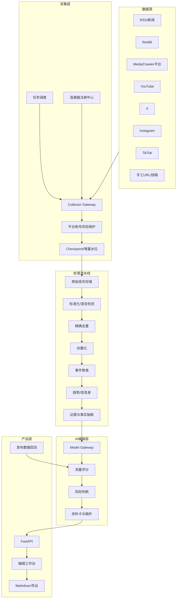

# AI 编辑部系统技术开发文档 V1.2

> 文档状态：已补充 MediaCrawler 五项增强与平台账号风险保护 / 技术实施基线  
> 编写日期：2026-08-04  
> 关联文档：`AI编辑部_PRD_V1.2.md`

---

## 1. 技术目标

建立一套可扩展的事件编辑系统，支持：

1. 多平台公开数据采集；
2. 无关键词发现与有关键词补全；
3. 跨平台、跨语言去重和事件聚类；
4. 事件生命周期、来源链和证据状态；
5. 以账号增长为目标的编辑评分；
6. 本地模型与多个云 AI API 动态切换；
7. 人工审核、稿件编辑、Markdown 导出和数据复盘；
8. 新平台通过插件注册，不侵入核心业务。

---

## 2. 对 MediaCrawler 的使用策略

### 2.1 现有能力

MediaCrawler 开源版目前支持：

- 小红书；
- 抖音；
- 快手；
- B站；
- 微博；
- 百度贴吧；
- 知乎。

主要模式：

- 关键词搜索；
- 指定帖子/视频详情；
- 指定创作者主页；
- 评论与二级评论；
- 多种文件和数据库存储。

### 2.2 不建议直接重构为“整个系统”

MediaCrawler 应被包装为一个独立的 **Domestic Social Collector Service**，而不是把 AI、事件聚类、评分和前端全部塞回其代码库。

理由：

- 采集器变化频繁，编辑业务应保持稳定；
- 不同平台可能使用 API、RSS、浏览器或第三方服务，技术路径不同；
- MediaCrawler 当前许可证限制商业用途；
- 后续可能替换某个平台实现，但不应影响事件数据和稿件。

### 2.3 推荐集成方式

```text
主系统 Scheduler
  ↓ 创建采集任务
Collector Gateway
  ├─ MediaCrawler Adapter
  ├─ Reddit Adapter
  ├─ RSS Adapter
  ├─ YouTube Adapter
  ├─ X Adapter
  ├─ Instagram Adapter
  └─ Manual Import Adapter
  ↓
统一 Signal Schema
```

MediaCrawler 可以通过以下方式接入：

- MVP：子进程调用 CLI，读取 JSONL / SQLite；
- V1：包装为独立 FastAPI 服务；
- 商业版：取得授权或自研兼容连接器。

### 2.4 仅吸收的五项 MediaCrawler Pro 设计思想

本项目不以复刻 Pro 为目标，只吸收以下五项，并按主系统架构重新实现：

1. **断点续采**：保存任务 checkpoint，支持游标、页码、最后内容 ID、发布时间水位等恢复方式；
2. **增量采集**：基于水位、内容唯一键和更新时间，只处理新内容或有新增信息的内容；
3. **账号与代理抽象**：账号、浏览器 Profile、凭据和可选代理独立建模；MVP 仅支持人工选择和固定绑定，不做封禁后自动轮换；
4. **签名逻辑解耦**：通过 `SignatureProvider` 隔离签名实现，首期仍调用开源版现有逻辑；
5. **首页流与热榜补充发现**：热榜独立成 Connector；HomeFeed 在 V1 对少数平台低频灰度启用。

### 2.5 明确不吸收的 Pro 功能

- 不在首期全面去除 Playwright；
- 不重写所有平台签名和请求协议；
- 不做通用桌面视频下载器；
- 不把 AI Agent 塞进 MediaCrawler 内部；
- 不做全平台 HomeFeed 一次性接入；
- 不做大规模账号/IP自动轮换；
- 不开发验证码破解、指纹伪造或绕过平台限制的能力。

---

## 3. 总体架构



---

## 4. 推荐技术栈

### 4.1 MVP

| 模块 | 推荐 |
|---|---|
| 语言 | Python 3.11+ |
| Web API | FastAPI |
| 任务调度 | APScheduler / asyncio 定时任务 |
| 数据库 | PostgreSQL + pgvector；单机原型可先 SQLite |
| 缓存/队列 | MVP 可不引入；需要并发后使用 Redis + Celery/ARQ |
| ORM | SQLAlchemy 2.x |
| 数据模型 | Pydantic v2 |
| 前端 | React + Vite，或先复用简单管理页 |
| 对象存储 | 本地目录；后续 MinIO / S3 |
| 向量模型 | MVP 默认云 Embedding API；保留本地多语言 Embedding Provider |
| LLM | OpenAI 兼容 API + 本地 Ollama 适配 |
| 语音转写 | Whisper 系列或云 ASR，按候选事件调用 |
| 部署 | 本地 Windows 开发；V1 使用 Docker Compose |

### 4.2 本地开发设备

拯救者 R7000P 2021 常见 RTX 3060 6GB 版本可承担：

- 采集器和数据库；
- 小型 Embedding 模型；
- 4B 量化语言模型；
- 少量转写任务；
- 本地开发和联调。

建议将内存升级至 32GB。MVP 阶段采用“本地采集与聚类 + 低价云 API 深度判断”更经济。

---

## 5. 仓库结构建议

```text
ai-editorial-desk/
├── apps/
│   ├── api/                    # FastAPI 主服务
│   ├── web/                    # 编辑工作台
│   └── worker/                 # 后台任务进程
├── packages/
│   ├── connectors/
│   │   ├── base.py
│   │   ├── registry.py
│   │   ├── rss/
│   │   ├── reddit/
│   │   ├── mediacrawler/
│   │   ├── youtube/
│   │   ├── x/
│   │   ├── instagram/
│   │   └── manual/
│   ├── collector_runtime/
│   │   ├── checkpoint.py
│   │   ├── incremental.py
│   │   ├── risk_guard.py
│   │   ├── budgets.py
│   │   ├── accounts.py
│   │   └── signature_provider.py
│   ├── pipeline/
│   │   ├── normalize.py
│   │   ├── deduplicate.py
│   │   ├── embedding.py
│   │   ├── clustering.py
│   │   ├── trend_detection.py
│   │   └── evidence.py
│   ├── editorial/
│   │   ├── scoring.py
│   │   ├── risk.py
│   │   ├── prompts.py
│   │   └── schemas.py
│   ├── ai_gateway/
│   │   ├── base.py
│   │   ├── openai_compatible.py
│   │   ├── ollama.py
│   │   └── router.py
│   ├── domain/
│   │   ├── source.py
│   │   ├── signal.py
│   │   ├── event.py
│   │   ├── evidence.py
│   │   ├── draft.py
│   │   └── publication.py
│   └── common/
│       ├── config.py
│       ├── logging.py
│       └── exceptions.py
├── migrations/
├── tests/
├── scripts/
├── docker/
├── docs/
├── .env.example
├── docker-compose.yml
└── pyproject.toml
```

---

## 6. 连接器插件规范

### 6.1 BaseConnector

```python
from abc import ABC, abstractmethod
from collections.abc import AsyncIterator
from dataclasses import dataclass
from datetime import datetime

@dataclass(slots=True)
class CollectRequest:
    source_id: str
    mode: str                 # feed/search/account/detail
    query: str | None = None
    cursor: str | None = None
    since: datetime | None = None
    limit: int = 100
    account_id: str | None = None
    risk_policy_id: str | None = None
    checkpoint: dict | None = None

@dataclass(slots=True)
class RawSignal:
    platform: str
    external_id: str
    url: str
    title: str | None
    text: str | None
    author_id: str | None
    author_name: str | None
    published_at: datetime | None
    metrics: dict[str, int | float]
    media: list[dict]
    raw_payload: dict

class BaseConnector(ABC):
    connector_type: str

    @abstractmethod
    async def health_check(self) -> dict:
        ...

    @abstractmethod
    async def collect(self, request: CollectRequest) -> AsyncIterator[RawSignal]:
        ...

    @abstractmethod
    async def fetch_detail(self, external_id: str) -> RawSignal:
        ...
```

### 6.2 连接器能力声明

每个连接器注册以下能力：

```yaml
connector: instagram_official
capabilities:
  feed: false
  search: limited
  account_monitoring: true
  detail: true
  comments: authorized_only
  realtime: webhook_optional
  official_api: true
  requires_oauth: true
```

主系统根据能力选择任务，不假设所有平台都支持关键词搜索或热门流。

### 6.3 连接器配置的存储与操作原则

连接器运行配置存储在数据库中，并通过可视化配置中心管理。下面的 YAML 仅代表系统内部序列化结构，可用于初始化、批量导入导出、环境迁移和备份恢复；日常启停、账号维护、频率调整和评论抽样不要求用户直接编辑文件。

```yaml
sources:
  - id: reddit_weird
    connector: reddit
    enabled: true
    mode: feed
    targets:
      - NotTheOnion
      - todayilearned
      - technology
    cadence_minutes: 30
    max_items: 100

  - id: ig_entertainment_accounts
    connector: instagram_official
    enabled: false
    mode: account
    account_ids: []
    cadence_minutes: 60
```

配置写入流程：

```text
前端动态表单
→ JSON Schema 校验
→ 凭据字段拆分并加密
→ 生成配置版本
→ 保存 connector_instance
→ Scheduler 热更新
→ 可选执行测试连接或立即运行
```

### 6.4 Connector Definition 与动态表单 Schema

每种连接器注册一份定义，至少包含：

```json
{
  "connector_type": "mediacrawler_weibo",
  "display_name": "微博",
  "platform": "weibo",
  "capabilities": {
    "search": true,
    "account": true,
    "detail": true,
    "comments": true,
    "oauth": false,
    "qr_login": true
  },
  "config_schema": {
    "type": "object",
    "required": ["cadence_minutes", "max_items"],
    "properties": {
      "modes": {
        "type": "array",
        "title": "采集模式",
        "items": {"enum": ["search", "account", "detail", "comments"]}
      },
      "cadence_minutes": {
        "type": "integer",
        "title": "采集频率（分钟）",
        "minimum": 5,
        "default": 30
      },
      "max_items": {
        "type": "integer",
        "title": "单次最大数量",
        "minimum": 1,
        "maximum": 1000,
        "default": 100
      },
      "comment_sample_limit": {
        "type": "integer",
        "title": "评论抽样数量",
        "minimum": 0,
        "default": 30
      }
    }
  },
  "ui_schema": {
    "modes": {"widget": "checkbox_group"},
    "credentials": {"widget": "secret_input"}
  }
}
```

前端优先使用 JSON Schema 自动生成通用表单。扫码登录、OAuth 回调、账号选择器等特殊能力使用连接器专属组件扩展。

### 6.5 连接器配置中心功能

MVP 必须支持：

- 列出连接器定义和实例；
- 新建、复制、编辑、启用、停用和归档实例；
- 测试连接、立即运行和查看最近运行结果；
- 显示登录状态、健康状态、下次运行时间和最近错误；
- 保存配置版本和操作者；
- YAML/JSON 导入导出；
- 敏感字段掩码显示和替换；
- 配置校验失败时禁止覆盖有效版本。

V1 增加批量启停、版本差异、回滚、灰度配置、多采集节点和配额面板。

---

## 7. 核心数据模型

### 7.1 Source

```yaml
id: uuid
name: string
connector_type: string
platform: string
source_kind: feed | account | board | search | manual
language: string
country: string
category: string
credibility_tier: S | A | B | C
config: jsonb
enabled: boolean
last_success_at: datetime
last_error: text
```

### 7.2 Signal

信号是单条帖子、视频、报道、评论或声明。

```yaml
id: uuid
source_id: uuid
platform: string
external_id: string
canonical_url: string
content_type: post | video | article | comment | statement
raw_title: text
raw_text: text
normalized_text: text
language: string
published_at: datetime
collected_at: datetime
metrics: jsonb
media: jsonb
content_hash: string
embedding: vector
raw_payload_location: string
```

唯一约束建议：

```text
(platform, external_id)
canonical_url_hash
content_hash + time bucket
```

### 7.3 Event

```yaml
id: uuid
title: string
summary: text
category: string
status: emerging | growing | stable | declining | resolved
first_seen_at: datetime
last_updated_at: datetime
primary_language: string
entities: jsonb
keywords: jsonb
centroid_embedding: vector
source_count: integer
platform_count: integer
```

### 7.4 EventSignal

```yaml
event_id: uuid
signal_id: uuid
relation: origin | report | repost | reaction | official_response | correction
confidence: float
```

### 7.5 EvidenceClaim

```yaml
id: uuid
event_id: uuid
claim_text: text
claim_type: fact | allegation | opinion | forecast
verification_state: confirmed | investigating | single_source | disputed | false
supporting_signal_ids: uuid[]
contradicting_signal_ids: uuid[]
editor_note: text
```

### 7.6 EditorialScore

```yaml
event_id: uuid
score_template: string
emotion: int
information_gap: int
visual_value: int
user_relevance: int
discussion: int
novelty: int
extendability: int
traffic_total: float
risk_level: R0 | R1 | R2 | R3 | R4
recommended_format: string
model_name: string
model_reason: text
human_override: jsonb
```

### 7.7 Draft / Publication / Performance

保存稿件版本、人工修改、发布时间、平台地址和播放数据，为后续评分校准提供样本。

### 7.8 配置中心数据模型

```text
connector_definitions
- id
- connector_type
- display_name
- platform
- capabilities jsonb
- config_schema jsonb
- ui_schema jsonb
- implementation_version
- enabled_in_build

connector_instances
- id
- definition_id
- name
- enabled
- config jsonb
- schedule_config jsonb
- credential_ref
- node_id
- last_success_at
- last_error
- created_by / updated_by
- config_version

connector_credentials
- id
- instance_id
- secret_type
- encrypted_payload / secret_reference
- masked_hint
- expires_at
- updated_by

connector_config_versions
- id
- instance_id
- version
- config_snapshot jsonb
- changed_fields jsonb
- created_by
- created_at

ai_providers
- id
- name
- provider_type
- base_url
- enabled
- credential_ref
- timeout_seconds
- concurrency_limit
- daily_budget
- monthly_budget
- capabilities jsonb

ai_models
- id
- provider_id
- model_name
- task_types jsonb
- context_window
- input_price
- output_price
- embedding_dimensions
- enabled

ai_task_routes
- task_type
- primary_model_id
- fallback_model_ids jsonb
- retry_policy jsonb
- budget_policy jsonb
- config_version

configuration_audit_logs
- id
- actor_id
- resource_type
- resource_id
- action
- before_snapshot jsonb
- after_snapshot jsonb
- created_at
```

凭据表与普通配置表分离，业务 API 不返回加密载荷。

### 7.9 采集恢复、账号与风险控制模型

```text
connector_checkpoints
- id
- connector_instance_id
- account_id
- mode
- cursor jsonb
- last_external_id
- last_published_at
- page_number
- watermark
- run_id
- updated_at

platform_accounts
- id
- platform
- account_alias
- purpose                 # test / collection / authorized
- browser_profile_ref
- credential_ref
- proxy_profile_id nullable
- status                  # healthy/warning/cooldown/review_required/restricted/disabled
- risk_level
- last_success_at
- last_warning_at
- last_warning_code
- consecutive_failures
- cooldown_until
- manual_review_required

account_risk_events
- id
- account_id
- connector_run_id
- risk_type
- platform_code
- http_status
- message
- action_taken            # stop_task/pause_account/pause_platform/manual_review
- raw_context jsonb
- created_at

collection_budgets
- id
- scope_type              # platform/account/connector/task
- scope_id
- max_requests_per_run
- max_items_per_run
- max_comments_per_item
- max_runs_per_day
- concurrency_limit
- sub_comments_enabled
- reset_at

signature_providers
- id
- platform
- provider_type
- endpoint_or_module
- version
- enabled
- health_status
```

风险事件与普通运行错误分表，避免普通失败日志掩盖账号安全信号。

### 7.10 账号状态机

```text
HEALTHY
  └─ 单次轻微异常 → WARNING
WARNING
  ├─ 后续成功 → HEALTHY
  ├─ 达到失败阈值 → COOLDOWN
  └─ 明确风控信号 → REVIEW_REQUIRED
COOLDOWN
  ├─ 冷却结束 + 人工确认 → HEALTHY
  └─ 再次异常 → REVIEW_REQUIRED
REVIEW_REQUIRED
  ├─ 人工确认恢复 → HEALTHY
  ├─ 平台限制 → RESTRICTED
  └─ 人工停用 → DISABLED
```

明确的账号限制、验证码、自动化检测或权限拒绝不得通过普通重试自动恢复。

---

## 8. 数据流水线

### 8.1 阶段 1：原始采集

- 原始结果先保存，不在连接器内做复杂 AI 判断；
- 写入幂等键，重复任务不会重复入库；
- 记录 HTTP 状态、游标、配额和失败原因；
- 每批成功写入后更新 checkpoint，不在请求开始前提前推进水位；
- 使用平台 ID、URL 哈希和时间水位执行增量采集；
- 所有请求先经过账号状态、预算和风险策略检查；
- 大字段和原始 HTML 可写对象存储，数据库只存索引。

### 8.2 阶段 2：标准化

处理：

- 时间统一为 UTC，界面转换为 Asia/Shanghai；
- 去除 HTML 和无意义模板；
- 语言检测；
- URL 规范化；
- 互动指标映射为统一字段；
- 提取 hashtag、mention、地点和实体候选。

### 8.3 阶段 3：低成本过滤

规则先处理：

- 空文本、广告和明显重复；
- 超过时间窗的旧内容；
- 互动过低且无来源价值的内容；
- 黑名单账号和敏感数据；
- 已归档事件的无新增搬运。

### 8.4 阶段 4：向量化和聚类

建议组合：

1. 精确哈希去重；
2. MinHash / SimHash 处理近似文本；
3. 多语言 Embedding 召回相似内容；
4. 时间、实体、地点和媒体哈希作为聚类特征；
5. LLM 只对边界样本做最终判断。

伪代码：

```python
candidates = vector_store.search(signal.embedding, top_k=20)
for event in candidates:
    score = hybrid_similarity(signal, event)
    if score >= AUTO_MERGE_THRESHOLD:
        attach(signal, event)
        break
else:
    if boundary_candidates:
        decision = llm_event_match(signal, boundary_candidates)
        apply(decision)
    else:
        create_event(signal)
```

### 8.5 阶段 5：趋势与信息差

每个事件计算：

```text
velocity = 最近窗口互动增量 / 时间
cross_source = 独立来源数量
cross_platform = 平台数量
novelty = 与历史事件距离
cn_gap = 海外信号强度 - 国内信号强度
update_value = 新增事实/回应/画面数量
```

不同平台指标不可直接比较，应先做平台内分位数或 Z-score 归一化。

### 8.6 阶段 6：证据抽取

模型输入只包含高价值信号的摘要和来源元数据，输出严格 Schema：

```json
{
  "claims": [
    {
      "text": "监管工作人员称正在调查处置",
      "type": "fact",
      "state": "investigating",
      "supporting_signal_ids": ["..."],
      "confidence": 0.88
    }
  ],
  "unknowns": ["尚无正式书面通报", "最终检测结果未知"]
}
```

任何没有 supporting_signal_ids 的内容不得进入“已确认事实”。

### 8.7 MediaCrawler 增强运行时

#### 8.7.1 断点续采

不同平台按能力选择恢复键：

```text
API有游标：cursor / max_cursor
列表有页码：page_number + last_external_id
仅有发布时间：last_published_at + content_hash
评论分页：note_id + comment_cursor
```

Checkpoint 更新规则：

1. 一批数据完成标准化并成功入库后再保存；
2. 任务异常不清空已保存 checkpoint；
3. 人工可选择“从断点继续”或“从头重新运行”；
4. checkpoint 与连接器实例、账号、模式和查询条件绑定；
5. 查询条件发生实质变化时生成新的 checkpoint namespace。

#### 8.7.2 增量采集

- 默认只处理晚于水位的新内容；
- 已存在内容只在互动量、评论或正文发生变化时更新；
- 连续命中一定数量的旧内容后提前停止翻页；
- 评论采用抽样和增量游标，不默认全量回刷；
- 数据库幂等约束作为最终兜底。

#### 8.7.3 账号与代理抽象

MVP 支持：账号录入、浏览器 Profile 固定绑定、人工选择、状态检测和可选固定代理。V1 才考虑账号冷却、人工切换和不同节点绑定。系统不在账号受限后自动换号继续采集。

#### 8.7.4 签名逻辑解耦

```python
class SignatureProvider(Protocol):
    async def sign(
        self,
        *,
        platform: str,
        url: str,
        params: dict,
        account_id: str,
    ) -> dict: ...
```

首期实现 `MediaCrawlerSignatureProvider`，内部复用现有代码。未来平台官方接口、独立 Node 服务或其他合规实现只需替换 Provider。

#### 8.7.5 HomeFeed 与热榜

- 热榜使用独立 `HotlistConnector`，不与 MediaCrawler 强耦合；
- HomeFeed 仅在 V1 对白名单平台启用；
- 单次只读取少量条目，不默认下载媒体和评论；
- 记录推荐来源账号、推荐时间和去重哈希；
- HomeFeed 失败不影响 RSS、热榜、账号监控和关键词补全。

### 8.8 平台账号风险保护层

所有浏览器自动化和非官方接口请求必须经过 `PlatformRiskGuard`：

```python
class PlatformRiskGuard(Protocol):
    async def before_request(self, context) -> None: ...
    async def after_response(self, context, response) -> None: ...
    async def handle_error(self, context, error) -> str: ...
```

#### 错误分类

**可有限重试：** 网络超时、DNS、偶发 5xx、本地浏览器断连、数据库短暂失败。

**不可自动重试：** 验证码、滑块、403、406、429、平台权限拒绝、`account blocked`、检测到自动化/AI操作、登录刚完成即失效、明确账号异常。

#### 处理策略

```text
风险信号
→ 停止当前任务
→ 保存 checkpoint
→ 标记账号状态
→ 暂停该账号或平台队列
→ 记录风险事件
→ 要求人工检查
```

不可自动执行“重新扫码后继续”“无限重试”“换账号继续”或“换代理继续”。

#### 保守默认模板

```yaml
risk_policy:
  concurrency: 1
  max_items_per_run: 20
  max_comments_per_item: 10
  sub_comments_enabled: false
  max_runs_per_day: 3
  auto_relogin: false
  manual_run_requires_confirmation: true
  on_captcha: pause_and_review
  on_account_restricted: disable_account
```

该模板是初始保护线，不代表任何平台的安全保证。

---

## 9. AI Gateway 设计

### 9.1 统一接口

```python
class AIProvider(Protocol):
    async def chat_json(
        self,
        *,
        model: str,
        messages: list[dict],
        response_schema: dict,
        temperature: float = 0.1,
        timeout_seconds: int = 60,
    ) -> dict: ...

    async def embed(self, texts: list[str], model: str) -> list[list[float]]: ...
```

### 9.2 Provider 配置原则

Provider、模型和任务路由通过可视化后台管理并存入数据库。YAML 仅用于初始化、导入导出和环境恢复：

```yaml
ai:
  providers:
    local_ollama:
      type: openai_compatible
      base_url: http://localhost:11434/v1
      credential_ref: secret://ollama/local

    openai:
      type: openai
      credential_ref: secret://openai/default

    deepseek:
      type: openai_compatible
      base_url: https://api.deepseek.com
      credential_ref: secret://deepseek/default

  routes:
    embedding:
      primary: cloud_embedding
      fallbacks: [local_embedding]
    extraction:
      primary: low_cost_cloud
      fallbacks: [local_ollama]
    scoring:
      primary: low_cost_cloud
      fallbacks: [strong_cloud]
    final_review:
      primary: strong_cloud
      fallbacks: [low_cost_cloud]
```

模型名称、供应商和路由不得写死在业务代码中。

### 9.3 AI Provider 管理中心

可视化页面支持：

- 新增、编辑、启用和停用 Provider；
- 选择官方 OpenAI、OpenAI-compatible、本地 Ollama 或自定义适配器；
- 配置 Base URL、超时、并发、重试、日预算和月预算；
- 录入或替换 API Key，前端只显示掩码；
- 测试网络、鉴权、模型调用、Embedding 和 JSON Schema 能力；
- 自动或手工同步模型列表；
- 查看成功率、平均延迟、Token 和费用；
- 标记某模型支持的任务类型、上下文和价格。

### 9.4 AI 任务路由中心

任务路由至少覆盖：

- embedding；
- extraction；
- event_match；
- scoring；
- evidence；
- drafting；
- final_review；
- vision；
- asr。

每条路由配置主模型、备用模型链、超时、重试、并发、预算超限策略和人工兜底。路由修改后对新任务热生效，不中断正在执行的任务。

### 9.5 成本控制

- 规则过滤后再调用模型；
- Embedding 批处理；
- 相同 prompt 和事件版本使用缓存；
- 只把评论抽样摘要给模型；
- TOP 20 才做深度分析；
- TOP 5 才生成长稿；
- 记录调用与最终是否采用，计算“每个被采用选题的 AI 成本”。

### 9.6 Prompt 版本管理

每次 AI 结果记录：

- prompt_version；
- model；
- temperature；
- input_hash；
- schema_version；
- token_usage；
- latency；
- cost；
- human_feedback。

---

## 10. 编辑评分引擎

### 10.1 配置化模板

```yaml
score_templates:
  daily_info_gap:
    weights:
      emotion: 0.20
      information_gap: 0.20
      visual_value: 0.15
      user_relevance: 0.10
      discussion: 0.15
      novelty: 0.15
      extendability: 0.05
    evidence_gate: R2

  food_safety:
    weights:
      emotion: 0.10
      information_gap: 0.10
      visual_value: 0.10
      user_relevance: 0.25
      discussion: 0.10
      novelty: 0.05
      extendability: 0.10
      evidence_quality: 0.20
    evidence_gate: R1
```

### 10.2 AI 与规则分工

规则计算：

- 发布时间；
- 来源数；
- 平台数；
- 互动增长；
- 国内外信号差；
- 素材是否存在。

AI 判断：

- 情绪张力；
- 反转；
- 普通人代入；
- 可讲角度；
- 评论问题；
- 不同栏目适配度。

最终结果必须展示“数据分”和“语义分”，避免黑箱。

---

## 11. 视频与图片处理

### 11.1 分级处理

```text
全量信号：只读标题、文案、互动和链接
候选事件：获取字幕/简介/代表性评论
TOP 20：无字幕时进行音频转写
TOP 10：提取有限关键帧
TOP 5：视觉模型分析与人工素材确认
```

### 11.2 长视频

- 优先官方字幕；
- 使用章节、时间戳和评论高频时间点选段；
- 音频分块转写；
- 每块摘要后再生成全局摘要；
- 保留时间码，稿件中的事实可以回到原视频位置。

### 11.3 存储策略

默认不永久保存完整视频：

- URL；
- 内容 ID；
- 媒体哈希；
- 字幕；
- 必要关键帧；
- 缓存文件设置自动过期。

---

## 12. 平台适配注意事项

### 12.1 Instagram / IG

- 官方 API 重点服务授权的 Business / Creator 专业账号；
- 不应假设官方 API 提供全站公共热门内容搜索；
- 第一版可做“监控授权账号、指定专业账号、人工 URL 导入”；
- 海外热门发现可使用其他公开源先发现，再把 IG 作为素材补全；
- 若使用第三方数据服务，需审查授权、数据来源、保留规则和商业许可。

### 12.2 TikTok

- Display API 主要访问授权用户的个人资料和公开视频；
- Research API 需要资格审核，主要面向符合条件的非营利研究；
- 不将 Research API 作为商业产品的默认依赖；
- TikTok 与抖音连接器分离，不能简单复用域名和签名。

### 12.3 Reddit

- 优先使用官方开发者能力或合规访问方式；
- 注意数据保留、删除同步和开发者政策；
- 如果在 Reddit 的 Devvit 应用内使用 LLM，应再次核对其最新批准模型和数据限制；
- 系统不使用 Reddit 数据训练或微调生成模型。

### 12.4 YouTube

- 使用 Data API 获取频道、视频、搜索和统计；
- 所有请求纳入配额预算；
- 优先监控频道和播放列表，减少高成本全局搜索；
- 字幕和视频下载另行遵守服务条款和版权。

### 12.5 X

- 访问能力与套餐、配额和审核可能变化；
- 连接器必须支持按账号列表、查询和计数接口分别降级；
- 不在核心逻辑中依赖某个固定套餐。

### 12.6 国内平台

- 登录态、页面结构和风控变化频繁；
- 降低并发，采用增量和抽样；
- 单独测试账号，不与主要运营账号共用；
- Cookie、二维码登录和代理配置必须加密存储；
- 商业化前审查代码许可证和平台条款。

### 12.7 国内平台账号风险控制

- 采集账号与发布账号、个人主账号完全分离；
- 一个账号固定绑定独立浏览器 Profile，避免频繁变更设备与登录环境；
- 高风险平台默认使用可见真实 Chrome + CDP，不默认无头运行；
- 新账号按“连通性测试、低量试运行、受控运行”三级启用；
- 小红书、抖音等优先作为候选事件补全平台，而非全天候大范围搜索入口；
- 触发权限拒绝、验证码、账号限制后立即熔断，不自动重新扫码；
- 风险控制只能降低概率，不能保证账号绝对不被限制。

### 12.8 不实现的反检测能力

- 验证码或滑块自动破解；
- 浏览器指纹伪造；
- 封禁或受限后自动轮换账号；
- 代理池切换以绕过平台限制；
- 明确收到限制后的持续重试；
- 自动隐藏或消除平台的自动化检测提示。

---

## 13. API 草案

```text
GET    /api/connector-definitions
GET    /api/connector-definitions/{type}/schema
POST   /api/connector-instances
GET    /api/connector-instances
PUT    /api/connector-instances/{id}
POST   /api/connector-instances/{id}/enable
POST   /api/connector-instances/{id}/disable
POST   /api/connector-instances/{id}/test
POST   /api/connector-instances/{id}/run
GET    /api/connector-instances/{id}/health
GET    /api/connector-instances/{id}/runs
GET    /api/connector-instances/{id}/checkpoint
POST   /api/connector-instances/{id}/resume
POST   /api/connector-instances/{id}/reset-checkpoint
GET    /api/connector-instances/{id}/versions
POST   /api/connector-instances/{id}/rollback
POST   /api/config/import
GET    /api/config/export

GET    /api/platform-accounts
POST   /api/platform-accounts
PUT    /api/platform-accounts/{id}
POST   /api/platform-accounts/{id}/test
POST   /api/platform-accounts/{id}/pause
POST   /api/platform-accounts/{id}/resume
GET    /api/platform-accounts/{id}/risk-events
GET    /api/risk-policies
PUT    /api/risk-policies/{id}
GET    /api/collection-budgets
PUT    /api/collection-budgets/{scope_type}/{scope_id}

POST   /api/ai/providers
GET    /api/ai/providers
PUT    /api/ai/providers/{id}
POST   /api/ai/providers/{id}/test
POST   /api/ai/providers/{id}/sync-models
GET    /api/ai/models
GET    /api/ai/routes
PUT    /api/ai/routes/{task_type}
GET    /api/ai/usage

POST   /api/sources
GET    /api/sources

GET    /api/signals
POST   /api/signals/import-url

GET    /api/events
GET    /api/events/{id}
POST   /api/events/{id}/merge
POST   /api/events/{id}/split
POST   /api/events/{id}/rescore
POST   /api/events/{id}/status

GET    /api/editorial/daily
POST   /api/editorial/generate
POST   /api/editorial/{event_id}/decision

GET    /api/drafts/{event_id}
POST   /api/drafts/{event_id}/generate
PUT    /api/drafts/{draft_id}
GET    /api/drafts/{draft_id}/export.md

POST   /api/performance/import
GET    /api/analytics/sources
GET    /api/analytics/editorial
GET    /api/analytics/costs
```

---

## 14. 调度策略

### MVP

```yaml
jobs:
  rss_fast:
    every_minutes: 15
  reddit_rising:
    every_minutes: 30
  domestic_hotlists:
    every_minutes: 30
  monitored_accounts:
    every_minutes: 60
  event_recluster:
    every_minutes: 30
  daily_editorial_cutoff:
    at: "18:00 Asia/Shanghai"
  draft_generation:
    at: "18:30 Asia/Shanghai"
```

高频并不等于大规模。每个任务限制来源、页数、增量游标和账号预算。小红书、抖音等高风险平台首期不进入统一高频任务，只在候选事件补全或人工触发时运行；明确风控信号会暂停后续调度。

---

## 15. 可观测性

### 15.1 日志

- connector_run_id；
- source_id；
- request_count；
- item_count；
- new_item_count；
- error_code；
- retry_count；
- duration；
- rate_limit_remaining；
- account_id；
- checkpoint_before / checkpoint_after；
- risk_classification；
- action_taken。

### 15.2 指标

- 每个来源的信号数、事件数和采用数；
- 聚类前后压缩比；
- 事件人工合并/拆分率；
- AI 推荐采用率；
- 资料卡人工修改比例；
- 单个被采用事件平均成本；
- 平台连接器成功率；
- 每日出稿耗时；
- 账号风险事件数；
- 各任务类型触发熔断率；
- checkpoint 恢复成功率；
- 重复请求避免数量。

### 15.3 告警

- 登录失效；
- 配额耗尽；
- 连续任务失败；
- 采集量异常为零；
- API 成本超预算；
- 数据库或磁盘空间不足；
- 账号进入 `review_required` 或 `restricted`；
- 验证码、权限拒绝、403/406/429、`account blocked`；
- 单账号达到日预算；
- 同一平台短时间连续风险事件。

---

## 16. 安全设计

- `.env` 仅保存部署级配置，仓库提供 `.env.example`；
- 系统加密主密钥不得保存在业务数据库；
- 生产使用 Secret Manager 或系统凭据存储；
- Cookie、Token、API Key 加密或保存为 Secret 引用；
- 凭据写入与普通配置写入分离；
- 前端不直接获取第三方密钥，只能看到掩码并执行替换；
- 配置导出默认排除凭据，显式包含时也必须加密；
- 原始数据访问按角色授权；
- 操作保留审计日志；
- 支持删除来源及相关缓存；
- 对用户投稿做恶意文件和链接检查；
- 国内平台自动采集仅使用独立测试账号和独立浏览器 Profile；
- 风控信号触发后停止任务并要求人工确认，不自动重新登录继续；
- 不开发验证码破解、指纹伪造、自动换号或绕过平台限制的能力；
- 账号、代理和签名 Provider 的配置变更进入审计日志。

---

## 17. 测试策略

### 17.1 单元测试

- URL 规范化；
- 时间转换；
- 内容哈希；
- 评分公式；
- Schema 校验；
- Provider 降级；
- checkpoint 保存与恢复；
- 可重试/不可重试错误分类；
- 账号状态机和预算重置；
- 风险熔断不会误触发自动重新登录。

### 17.2 连接器测试

- 使用保存的合法响应 Fixture；
- 禁止 CI 中大规模请求真实平台；
- 每个平台维护 smoke test；
- 页面结构变化后快速定位解析失败；
- 风控测试使用 Fixture 和模拟响应，不在 CI 中主动触发真实平台限制；
- 每个平台维护低量 smoke test 和人工启用开关。

### 17.3 聚类评测集

建立人工标注集：

- 同一事件不同说法；
- 相似但不同事件；
- 中英文同一事件；
- 老事件重新发酵；
- 同人物不同事件。

评估：Precision、Recall、错误合并率和漏合并率。

### 17.4 编辑评测

每周抽样：

- 系统 TOP 10；
- 人工 TOP 10；
- 实际高流量内容；
- 系统放弃但后来爆发的事件。

记录错题并调整来源和权重。

---

## 18. 部署方案

### 18.1 本地 MVP

```text
Windows 11
├─ Chrome + 登录态
├─ MediaCrawler
├─ FastAPI
├─ PostgreSQL / SQLite
├─ 可选 Ollama / 本地 Embedding
└─ 云 Embedding + 云 AI API
```

采集和模型任务可分时运行，避免 16GB 内存压力。

### 18.2 V1 Docker Compose

```yaml
services:
  api:
  worker:
  scheduler:
  web:
  postgres:
  redis:
  minio:
```

涉及扫码登录和浏览器自动化的平台，可先保留在 Windows 采集节点，通过内部 API 推送数据到服务器。

---

## 19. 实施计划

### 第 1 周：发现、入库与连接器配置中心

- 初始化仓库和数据库；
- 实现 Connector SDK、Definition Registry 和 JSON Schema；
- 完成连接器列表、新建、编辑、启停、测试和运行日志页面；
- 接 RSS、Reddit、手工 URL；
- 包装 MediaCrawler 首批平台；
- 增加账号/Profile抽象和 SignatureProvider 接口；
- 采用独立测试账号执行连通性与低量试跑；
- 完成统一 Signal Schema；
- 完成 checkpoint、增量水位和幂等去重；
- 完成风险错误分类、账号状态机、预算与熔断基础能力；
- 完成凭据掩码与加密存储基础能力。

### 第 2 周：事件、AI 配置与日报

- 去重、Embedding、事件聚类；
- AI Gateway；
- 完成 Provider 新增、测试连接、模型管理和任务路由页面；
- 评分与风险 Schema；
- TOP 10 页面；
- 资料卡和 Markdown 导出；
- 配置版本、导出和审计日志。

### 第 3—4 周：实跑修正

- 增加国内热榜和更多来源；
- 事件生命周期；
- 评论抽样；
- 统计来源命中率；
- 根据一周实际发布结果调整模型；
- 增加热榜连接器，评估少量 HomeFeed 灰度；
- 统计账号风险、熔断和增量采集效果。

### V1 后续

- YouTube、X、Instagram、TikTok；
- 视频字幕和关键帧；
- 发布数据回流；
- 更完整的工作台和权限；
- 受控 HomeFeed、账号安全中心和风险策略中心；
- 商业许可与合规替换。

---

## 20. 开发前必须确认

1. MediaCrawler 是仅用于内部原型，还是准备申请商业授权？
2. 第一批国内平台选微博+B站+知乎，还是包含抖音/小红书？
3. 是否有独立测试账号与扫码环境？
4. AI 供应商首选和月度预算是多少？
5. PostgreSQL 是否直接启用，还是先用 SQLite？
6. 是否把第一版前端控制在“事件列表 + 详情 + Markdown 导出”？
7. 每日出稿截止时间和预计候选事件数量是多少？
8. 哪些领域初期明确不做？

---

## 21. 参考资料

- MediaCrawler：<https://github.com/NanmiCoder/MediaCrawler>
- MediaCrawler 架构文档：<https://github.com/NanmiCoder/MediaCrawler/blob/main/docs/%E9%A1%B9%E7%9B%AE%E6%9E%B6%E6%9E%84%E6%96%87%E6%A1%A3.md>
- MediaCrawler License：<https://github.com/NanmiCoder/MediaCrawler/blob/main/LICENSE>
- Reddit Developer Platform：<https://developers.reddit.com/docs/>
- YouTube Data API：<https://developers.google.com/youtube/v3/getting-started>
- X API：<https://developer.x.com/en/docs/x-api>
- TikTok Developers：<https://developers.tiktok.com/doc/>
- Instagram API：<https://www.postman.com/meta/instagram/documentation/6yqw8pt/instagram-api>
- MediaCrawler 小红书账号封禁反馈：<https://github.com/NanmiCoder/MediaCrawler/issues/865>
- MediaCrawler 小红书自动化检测反馈：<https://github.com/NanmiCoder/MediaCrawler/issues/915>
- MediaCrawler 小红书权限拒绝日志：<https://github.com/NanmiCoder/MediaCrawler/issues/906>
